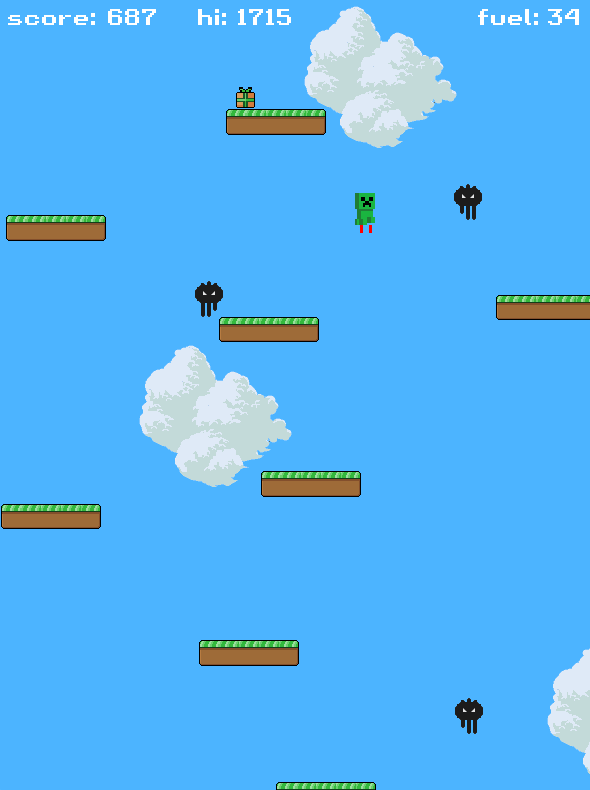

# Doodle Jump Game in C++ and SFML

Here's another C++ training project. This time, the goal was to recall object-oriented programming basics, use multiple header files, and some pointers. Another goal was to implement simple collision detection and some animations using sprites and textures. It seemed easy, but it turned out there was a lot of work to do. As in the previous project, I aimed to create a fully playable game with increasing difficulty, a scoring system, and engaging effects. The player has to jump precisely between randomly generated platforms and climb higher to score as many points as possible. The difficulty level increases with height, introducing more and more enemies along the way. The player can also collect jetpack fuel to skip jumping and speed up the journey :-)

# Features
* Dynamic and engaging gameplay
* Randomly generated platforms
* Animated game objects and background
* Increasing difficulty
* Jetpack!!!

# Todo
* Different sizes and colors for platforms
* Enemies jumping between platforms
* Sounds and music
* Executable files
